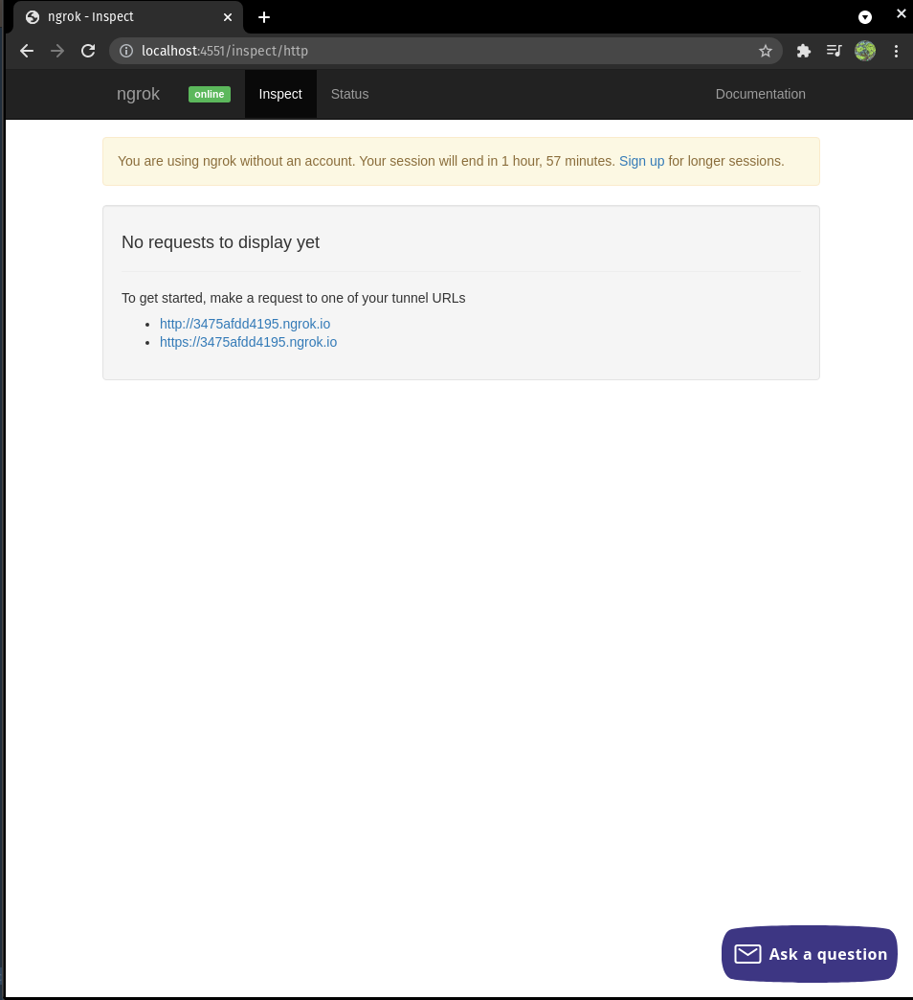

# Development

## Launching Local Development Server

launch development server with:

```
docker-compose up -d
```

navigate to [localhost:4551](http://localhost:4551/) to view the
domain created by [ngrok](https://ngrok.com/).

your page should look something like:





navigate to your [app management
dashboard](https://api.slack.com/apps) on slack, and slack the bot
application that is being developed.

under the *Features* sidebar, there is a menu option called `Slash
Commands`. Select that menu option for a list of Slash commands for
that current bot. 

Edit the command that is being developed to use the ngrok url, from
our screenshot it is: `https://3475afdd4195.ngrok.io`. Note that our
web server serves slash commands under the path `/slash`.


save your changes and test your command in slack

## rebuild webserver

```
docker-compose up --build -d app
```

## webserver logs

```
docker-compose logs -tf app
```

## restart ngrok
```shell
docker-compose restart ngrok
```

